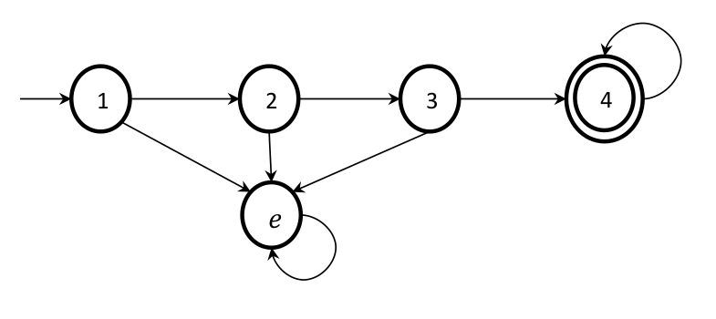

# DFA-simulator

A Deterministic Finite Automaton (DFA) simulator that validates words based on a given set of states and transitions.

## Input Format

The program expects the following input format:

- The first line: N states
- The second line: M symbols of the alphabet
- The next N lines: M values indicating the transitions for each state
- The next line: Initial state
- The next line: F final states
- The next line: T number of words to be tested
- The next T lines: One word per line to be validated by the automaton

### Example

Below is an example DFA diagram illustrating the transitions:



#### Input

```
1 2 3 4 e
a b
2 e
e 3
4 e
4 4
e e
1
4
3
abaaa
abbababa
abaabaaba

```

## Running the Program

To run the program with input redirection from a file, use the following command:

```
programaAFD.exe < input.txt
```


